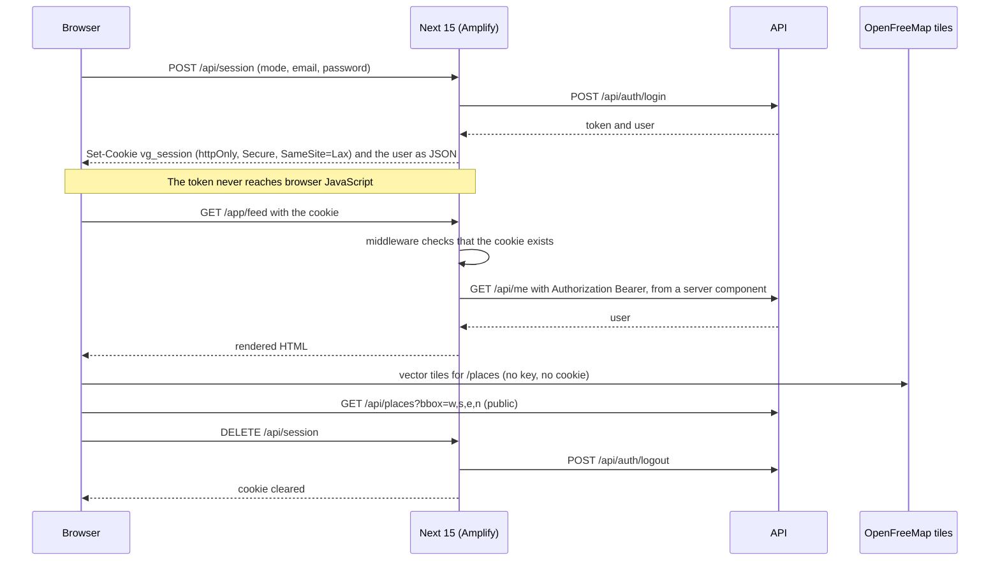

# Vegan Grove Web

**Public pages rendered on the server, a member area behind an httpOnly cookie, and no session token in the browser.**

[](https://github.com/wbaxterh/vegan-grove-web/actions/workflows/ci.yml)     [](./LICENSE) [](https://docs.vegangrove.org) 

Vegan Grove is a privacy-first vegan community and activism platform for Southern California. This repository is the website at `vegangrove.org`: a Next.js 15 App Router application that renders the public places, events, groves, media, and guides pages on the server and serves the authenticated `/app` area for the feed, messages, friends, the companion, and settings. It owns no data and talks to nothing but the Vegan Grove API and OpenFreeMap tiles.

## Part of Vegan Grove

| Repository | Role | Stack | Deploys to |
|---|---|---|---|
| [vegan-grove-api](https://github.com/wbaxterh/vegan-grove-api) | REST API, Socket.IO, workers, the only reader of the database | Express 5, Mongoose 9, zod, pino, Socket.IO, vitest | One EC2 instance, PM2 behind nginx, `us-east-1` |
| [vegan-grove-web](https://github.com/wbaxterh/vegan-grove-web) (this repo) | Public site and the `/app` member area | Next.js 15, Tailwind 4, shadcn/ui, MapLibre GL | AWS Amplify Hosting, `us-east-1`, on push to `main` |
| [vegan-grove-mobile](https://github.com/wbaxterh/vegan-grove-mobile) | iOS and Android app | Expo SDK 57, expo-router, TanStack Query, MapLibre | EAS Build, App Store and Play |
| [vegan-grove-docs](https://github.com/wbaxterh/vegan-grove-docs) | Product, privacy, and architecture docs | PokeDocs on Docusaurus 3 | AWS Amplify Hosting, `us-east-1`, on push to `main` |

Docs: [docs.vegangrove.org](https://docs.vegangrove.org). Product: [vegangrove.org](https://vegangrove.org). Both domains and `api.vegangrove.org` are launching.

## Architecture

The browser never holds the session. It posts credentials to a Next route handler, the handler exchanges them with the API, and the token comes back only as an httpOnly cookie. Server components forward that cookie as a Bearer header; client components call the same API for public data and are never handed a token.



Public pages are server components that call the API without a session and revalidate every 60 seconds; when the API is down they render an honest empty state instead of a 500. Pages under `/app` are rendered per request because they read the cookie. The map is the only page that is client-only from the top, because MapLibre needs `window`; its tile worker is self-hosted under `public/maplibre/` because Turbopack hashes the worker and its shared chunk separately, which breaks the worker's relative import and leaves the map blank.

## Quick start

```bash
nvm use                          # Node 24, from .nvmrc
npm ci
cp .env.example .env.local       # the dev defaults work against a local API on :4000
npm run dev                      # next dev --turbopack, http://localhost:3000
npm run validate                 # biome check, tsc --noEmit, next build
npx playwright install chromium  # once, then:
npm run test:e2e                 # Playwright smoke against the dev server
```

The site expects `vegan-grove-api` at `NEXT_PUBLIC_API_BASE_URL` (default `http://localhost:4000/api`) and runs without it. Husky runs Biome on staged code and `secretlint` on every staged file.

Playwright starts its own dev server on port 3000 and reuses one that is already running; set `PLAYWRIGHT_PORT` when something else owns that port. New shadcn components come from `npx shadcn@latest add <name>`, not from hand-written files, so upgrades stay clean.

## Scripts

| Script | What it does |
|---|---|
| `npm run dev` | `next dev --turbopack` |
| `npm run build` | `next build --turbopack`, what Amplify runs |
| `npm run predev`, `npm run prebuild` | copy MapLibre's worker and shared chunk into `public/maplibre/` (run automatically) |
| `npm start` | `next start` on a built app |
| `npm run lint` | `biome check .` |
| `npm run lint:fix` | `biome check --write .` |
| `npm run typecheck` | `tsc --noEmit` |
| `npm run test:e2e` | Playwright smoke in chromium: home renders, the map container mounts, `/app/feed` redirects to `/login?next=`, security headers are present |
| `npm run validate` | lint, typecheck, build: the CI contract and the PR gate (Playwright stays separate) |
| `npm run prepare` | installs the husky hooks |

## Configuration

Names only in [`.env.example`](./.env.example); never commit a `.env` file. On Amplify, set these in the console; the `amplify.yml` preBuild step copies `NEXT_PUBLIC_*` and `SESSION_*` into `.env.production` so `next build` can inline them.

| Variable | Purpose | Shape |
|---|---|---|
| `NEXT_PUBLIC_API_BASE_URL` | API base including `/api`; its origin is added to the CSP `connect-src` | URL, dev default `http://localhost:4000/api` |
| `NEXT_PUBLIC_MEDIA_CDN_ORIGIN` | Origin that serves uploaded images and posters; added to `img-src`, `media-src`, and `images.remotePatterns` | origin, no path |
| `NEXT_PUBLIC_SITE_URL` | Canonical origin for metadata, `robots.txt`, `sitemap.xml`, `llms.txt` | origin, default `https://vegangrove.org` |
| `SESSION_COOKIE_SECURE` | Force the cookie `Secure` flag; unset means secure in production only | `true` or `false` |

## Project layout

```
src/
  app/
    (site)/                public pages under the shared header and footer, plus login and signup
    app/                   member area: the layout validates the session, then feed, messages, friends, companion, settings
    api/session/route.ts   the only code that sees the session token; sets and clears vg_session
    llms.txt/ robots.txt/ sitemap.xml/   route handlers built from src/lib/site.ts
    globals.css            the --vg-* tokens mapped onto shadcn's variables; no other file defines a color
    layout.tsx             html, ThemeProvider (dark by default), system font stacks
  components/
    ui/                    shadcn components on Base UI, regenerated with the shadcn CLI, not edited by hand
    places/                places-map.tsx (MapLibre, client only) and its dynamic-import island
    auth/ app/ events/ media/   forms, member nav, cards, the youtube-nocookie trailer embed
    screen.tsx             the Context / Action / Support layout every page uses
  lib/
    api.ts                 apiFetch, the one HTTP client for browser and server
    api.server.ts          forwards the cookie as a Bearer header for server components
    session.ts             cookie name and options, shared with the middleware
    loaders.ts             public-page loaders that never turn an API outage into a 500
  middleware.ts            redirects /app/* without a cookie to /login?next=
public/maplibre/           MapLibre worker files, copied on predev and prebuild, gitignored
scripts/                   copy-maplibre-worker.mjs
tests/                     smoke.spec.ts (Playwright)
next.config.ts             CSP, HSTS, nosniff, X-Frame-Options, Referrer-Policy, Permissions-Policy
amplify.yml                Amplify build: env allowlist into .env.production, npm ci, next build, .next artifacts
```

## What works today

- Public routes: `/`, `/places` with the MapLibre map island querying `GET /api/places?bbox=` as the viewport settles, `/places/[slug]`, and the list and detail pages for `/events`, `/groves`, `/media`, `/guides`. The last four call routes the API still answers with `501`, so they render their empty states until the API lands them.
- Sign in: `/login` (password, plus a magic-link request) and `/signup` post to `/api/session`, which proxies the API and sets the cookie; `DELETE /api/session` signs out and revokes the session upstream.
- Member area: `middleware.ts` bounces `/app/*` without a cookie, the `/app` layout validates the session with `GET /api/me` and bounces expired cookies the same way, and `/app/settings` shows the member's handle, home area, and public-posts switch with a working sign out.
- `/privacy`, `/terms` (an outline), `robots.txt`, `sitemap.xml` from the public route list, `llms.txt`, a `not-found` page, dark and light themes.
- Security headers on every response, verified by the Playwright smoke test.

## Not yet

- `/app/feed`, `/app/messages`, `/app/friends`, and `/app/companion` are shells with disabled controls and the right copy; each carries a `TODO(m2)` naming the API routes it will call.
- Settings cannot yet edit the profile, sign out everywhere, or delete the account; the buttons are rendered disabled.
- Sign in with Apple and Google buttons are disabled on `/login` until the native and web flows exist.
- No place submission form, no guide markdown renderer (plain paragraphs until a sanitizing renderer is chosen), no reviewed terms copy.
- No `/handles/[handle]` public-posts view. It is allowed by privacy rule 1 and deliberately not built in the scaffold; when it is, it reads `GET /api/handles/:handle/posts` and nothing else.
- The CSP keeps `'unsafe-inline'` for scripts until the app moves to a per-request nonce.
- No Socket.IO client for the `/messages` namespace yet.

## Privacy, by construction

- The session is an httpOnly, `SameSite=Lax` cookie named `vg_session`, `Secure` in production, 30 days to match the API's sliding expiry. The session route returns the user, never the token.
- No token in JavaScript: nothing is written to `localStorage`, no client code reads the cookie, and `api.ts` only accepts a token from server code.
- The CSP starts at `default-src 'self'`, allows `connect-src` to the API origin, OpenFreeMap tiles, and the Bunny CDN only, sets `frame-ancestors 'none'`, and limits frames to `youtube-nocookie.com` for click-to-load trailers.
- No analytics, tag managers, or tracking pixels; aggregate numbers come from `GET /api/stats`. Any new external origin has to be added to the CSP in `next.config.ts` and justified in the PR.
- No external fonts or icon CDNs: system font stacks and inlined SVG icons, so no third party receives a page-view log.
- No route is keyed by a user id and there is no profile page. Device location only centers the map in the browser; the API sees a bounding box.

The full promise, data inventory, and threat model: [docs.vegangrove.org/privacy](https://docs.vegangrove.org/privacy).

## Contributing, security, license

The code is public so anyone can audit how member data is handled; read [`CONTRIBUTING.md`](./CONTRIBUTING.md) before opening a PR and [`SOUL.md`](./SOUL.md) before changing a screen. Report vulnerabilities through the process in [`SECURITY.md`](./SECURITY.md), never in a public issue. The [`LICENSE`](./LICENSE) is proprietary: read it, study it, contribute to it, and do not redistribute it.

Built by [Wes Huber](https://weshuber.com) · Sibling of [The Trick Book](https://thetrickbook.com) · Docs by [PokeDocs](https://github.com/wbaxterh/pokedocs)
